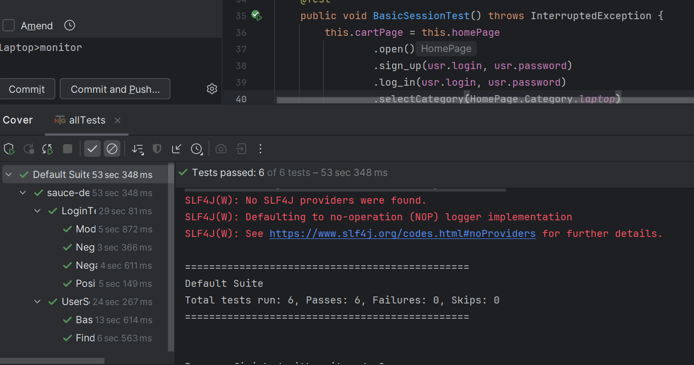

# Учебный проект по автоматизации тестирования
### Тест-кейсы на вход:
1. Регистрация пользователя, уже имеющегося в системе
2. Регистрация нового пользователя (можно реализовать, передав свежие данные для регистрации)
3. Проверка, что модальное окно для ввода данных закрылось (после нажатия ESC, так как селениум не может по какой-то причине кликнуть кнопки на модальном окне, либо я не сообразил как это сделать)
4. Вход с неверным паролем
5. Вход с верными данными УЗ
### Тест-кейс: базовая пользовательская сессия
1. Заходим на [сайт](https://www.demoblaze.com/#)
2. Нажимаем Sign Up и регистрируем УЗ JesseyPinkman с паролем Wat3rW8
3. Если УЗ уже существует, войдем под ее данными на следующем шаге
4. Логинимся под УЗ JesseyPinkman с паролем Wat3rW8
5. Добавляем в корзину товар и переходим в корзину
6. Заполняем форму заказа
7. Проверяем, что заказ успешен и появилось всплывающее окно
### Результаты прогона
